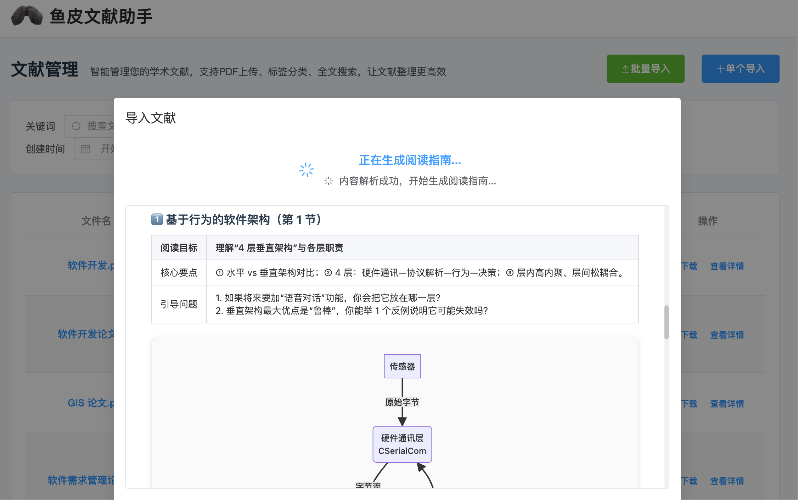
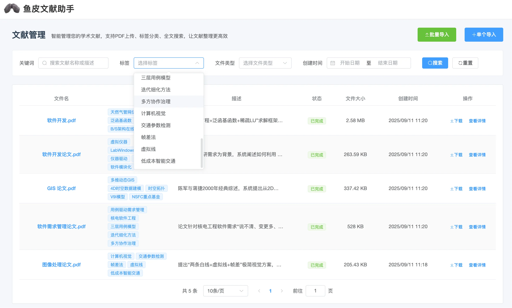

# 鱼皮文献助手

一个基于 Spring Boot 3 + Vue 的现代化文献管理后端服务，集成 AI 技术为用户提供智能文献阅读指南生成、文献管理和检索功能。



> 项目利用 AI Vibe Coding 实现

## ✨ 功能特性

- 📚 **文献上传与解析**: 支持 PDF、Word (.doc/.docx)、Markdown 格式文献的上传和内容解析
- 🤖 **AI 阅读指南生成**: 集成 Kimi AI，基于文献内容自动生成结构化阅读指南
- 🏷️ **智能分类标签**: AI 自动为文献生成分类标签，便于管理和检索
- 🔍 **多维度检索**: 支持关键词、标签、文件类型、时间范围等多种筛选条件
- ⚡ **实时流式响应**: 基于 SSE 技术，实时推送 AI 生成进度和结果
- 🔧 **完善的异常处理**: 统一异常处理机制，提供友好的错误信息
- 📖 **API 文档**: 集成 Knife4j，提供完善的 API 接口文档



## 环境准备

在启动项目前，请确保您的开发环境已经安装并正确配置了以下依赖。

- Java: 21+
- Node: 20+


### 1、Java 21+

**验证安装**

打开终端（macOS）或命令提示符（Windows），输入以下命令。如果能正确显示版本号（21 或更高版本），则说明 Java 环境已配置成功。

```bash
java -version
```

-----

**Windows 安装指南**

1. 访问官方 OpenJDK 发行版网站，例如 [Oracle JDK 21](https://www.oracle.com/java/technologies/downloads/#java21)。
2. 下载适用于 Windows x64 的 `.msi` 安装程序。
3. 双击运行安装程序，并按照图形化界面的提示完成安装。安装程序会自动配置 `JAVA_HOME` 环境变量和系统 `Path`。

-----

**macOS 安装指南**

推荐使用 [Homebrew](https://brew.sh/) 进行安装，方便管理。

1. 打开终端。
2. 执行以下命令安装 OpenJDK 21：
   ```bash
   brew install openjdk@21
   ```
3. 安装完成后，根据 Homebrew 的提示，将 Java 添加到环境变量中。

再次执行以下命令，如果能正常展示版本号即是安装成功：

```bash
java -version
```

### 2、Node.js (20+)

**验证安装**

打开终端或命令提示符，输入以下命令。如果能正确显示版本号（Node.js 为 20 或更高版本），则说明 Node.js 环境已配置成功。

```bash
node -v
```

-----

**Windows 安装指南**

1. 访问 [Node.js 官方网站](https://nodejs.org/en/download)。
2. 下载推荐的 Windows Installer (`.msi`) 版本（LTS，长期支持版）。
3. 双击运行安装程序，并按照默认选项完成安装。

-----

**macOS 安装指南**

推荐使用 [Homebrew](https://brew.sh/) 进行安装。

1. 打开终端。
2. 执行以下命令安装 Node.js 20：
   ```bash
   brew install node@20
   ```
3. 安装完成后即可直接使用 `node` 和 `npm` 命令。

## 🚀 快速开始

项目已内置 H2 数据库，无需安装和额外配置，开箱即用。

### 方式一：使用启动脚本 (推荐)

- **Windows 系统**: 双击运行根目录下的 `start.bat` 脚本。

- **Linux / macOS 系统**: 在项目根目录下执行 `start.sh` 脚本：

  ```bash
  sh start.sh
  ```

### 方式二：手动编译运行

```bash
# 编译项目
mvn clean compile

# 运行项目
mvn spring-boot:run

# 或者打包后运行
mvn clean package
java -jar target/literature-assistant-0.0.1-SNAPSHOT.jar
```

### 访问验证

- **应用服务**: http://localhost:8086/api
- **API 文档**: http://localhost:8086/api/doc.html
- **健康检查**: http://localhost:8086/api/literature/health

## 🛠 技术栈

- **框架**: Spring Boot 3.5.5
- **数据库**: H2 Database + MyBatis-Plus 3.5.5
- **连接池**: HikariCP
- **文档处理**: Apache POI (Word)、PDFBox (PDF)、CommonMark (Markdown)
- **AI 集成**: Kimi AI API + OkHttp SSE
- **API 文档**: Knife4j 4.5.0
- **工具库**: Hutool 5.8.29
- **Java 版本**: Java 21


## 🔧 核心配置说明

### 数据库配置

项目默认使用 H2 嵌入式数据库，数据文件将存储在项目根目录的 `data` 文件夹下，无需额外配置。

```yaml
spring:
  datasource:
    # 使用 H2 嵌入式数据库，无需安装
    driver-class-name: org.h2.Driver
    url: jdbc:h2:file:./data/literature_assistant
```

### 文件上传配置

```yaml
literature:
  file:
    upload-path: ./uploads/documents           # 文件存储路径
    max-file-size: 10MB                       # 单文件最大大小
    allowed-extensions: pdf,doc,docx,md,markdown # 允许的文件类型
```

### AI 服务配置

```yaml
literature:
  ai:
    base-url: https://api.moonshot.cn/v1      # Kimi AI API 地址
    model: kimi-k2-turbo-preview              # 使用的模型
    max-tokens: 20480                         # 最大 token 数
    temperature: 0.7                          # 生成随机性
    timeout: 60000                            # 请求超时时间（毫秒）
```

## 🔄 开发指南

### 添加新的文件类型支持

1. 在 `FileProcessingService` 中添加新的解析方法
2. 更新 `allowedExtensions` 配置
3. 在 `extractFileContent` 方法中添加类型判断

### 扩展查询条件

1. 在 `LiteratureQueryRequest` 中添加新的查询字段
2. 更新 `LiteratureMapper.xml` 中的查询条件
3. 确保数据库索引支持新的查询字段

## 🙏 致谢

- [Spring Boot](https://spring.io/projects/spring-boot) - 企业级 Java 应用框架
- [MyBatis-Plus](https://baomidou.com/) - MyBatis 增强工具
- [Kimi AI](https://www.moonshot.cn/) - 智能对话 AI 服务
- [Apache POI](https://poi.apache.org/) - Java 文档处理库
- [PDFBox](https://pdfbox.apache.org/) - Java PDF 处理库
- [Knife4j](https://doc.xiaominfo.com/) - API 文档生成工具
- [Hutool](https://hutool.cn/) - Java 工具类库

---

让 AI 赋能学术阅读，让文献理解更高效！